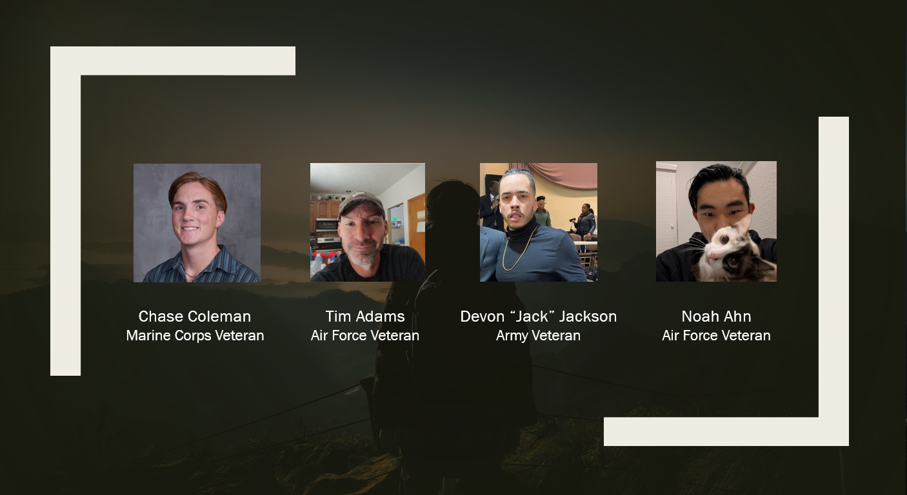
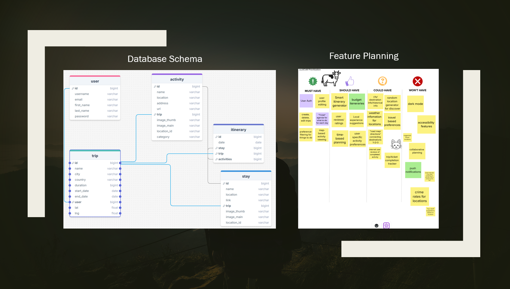
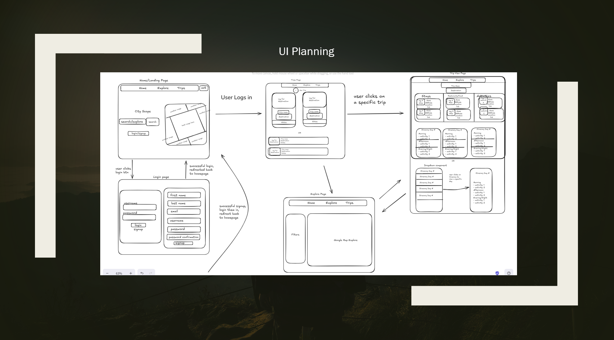

# City Scope - The World is Waiting...

## Description
City Scope is a full-stack travel planning app that lets users create accounts, build personalized trips, add stays, activities, and restaurants, and organize everything into daily itineraries. With Google Maps integration, users can explore their destinations and plan with confidence.

## 📑 Table of Contents
1. [Description](#description)
2. [Features](#features)
3. [Contributors](#contributors)
4. [Tech Stack](#tech-stack)
5. [Environment Variables](#environment-variables)

## Features
- Token Authentication
- Autocomplete Location Search
- Trip Creation
- Itinerary Creation
- Adding stays, restaurants, and activities to a trip and/or itinerary
- Exploration with Google Maps integration

## 👥 Contributors

[**Chase Coleman**](https://github.com/chase-coleman) – Team Lead, Activity Model, Explore Page + related components, and Google Maps Integration

[**Tim Adams**](https://github.com/timskillbridge) – Stay Model, Trip Advisor API integration, Login/Signup Page, User Account Management + related components

[**Noah Ahn**](https://github.com/Poptaro) – Itinerary Model, Trip View Page + related components, CSS Guru

[**Devon 'Jack' Jackson**](https://github.com/Jack-himlo) – Trip Model, and Trip Page + related components

## 💻 Tech Stack
### Frontend
- 
- 
-   
- 

### Backend
- 
-  
- 

### Third-Party APIs
- Google Maps JavaScript API + Google Places Library
- TripAdvisor API

## To Get Working with the Project:
1) Create your own virtual environment on your computer:
  - `python -m venv <your-virtual-environment-name>`
2) Clone down this repo to your computer:
  - `git clone https://github.com/chase-coleman/City-Scope-Group-Project.git`
3) Activate your virtual environment:
  - `source virtual-environment-name/bin/activate`
4) CD into the backend directory and install the venv dependency file:
  - `pip install -r requirements.txt`
5) CD out to root and into the frontend directory and install frontend dependencies:
  - `npm install`

### Environment Variables

In your **Frontend** directory, create a `.env` file and add the following variables once you have created accounts and received your API keys:

- `VITE_GOOGLE_MAPS_API_KEY` – API key access for the Google Maps JavaScript API  
  - [**Click here to get your Google Maps API Key**](https://developers.google.com/maps)
  
- `VITE_MAP_ID_V1` – MapID for the project's specific map in Google's Developer account
  
- `VITE_TRIP_ADVISOR_KEY` – API key access for TripAdvisor's API  
  - [**Click here to get your Trip Advisor API Key**](https://www.tripadvisor.com/developers)

## Endpoints

### User
- `api/v1/user/info/` - GET/PUT - user account info
- `api/v1/user/signup/` - POST - create new user account
- `api/v1/user/login/` - POST - user login
- `api/v1/user/logout/` - POST - user logout
- `api/v1/user/delete/` - DELETE - user account deletion

### Stays
- `api/v1/stay/all/` - GET - view all of a user's stays
- `api/v1/stay/<int:trip_id>/` - GET/PUT/DELETE/POST - view a specific stay

### Activities
- `api/v1/activity/all/<int:trip_id>/` - GET/POST - view all of a user's activities on a trip, or POST a new activity onto that trip
- `api/v1/activity/<int:id>/` - GET/PUT/DELETE - view a specific activity

### Itinerary
- `api/v1/itinerary/all/<int:trip_id>/` - GET - view all of a trip's itineraries
- `api/v1/itinerary/<int:id>/` - PUT/DELETE/POST - view a specific itinerary
- `api/v1/itinerary/` - GET - view a specific itinerary's info

### Trips
- `api/v1/trip/` - GET - view all of a user's trips
- `api/v1/trip/<int:pk>/` - GET/PUT/DELETE/POST - view a specific trip

### Trip Advisor 
- `api/v1/loc/locID` - GET - calls the Trip Advisor API to get the location_id of somewhere
- `api/v1/loc/apiUser` - POST - Creating a new user for the API
- `api/v1/apiUsed/<str:api_key>` - GET/PUT - view/update a user's total API calls

### Stretch Goals
- Creating multi-user trip planning so plan trips with friends
- AI integration to generate smart itineraries

### Planning

